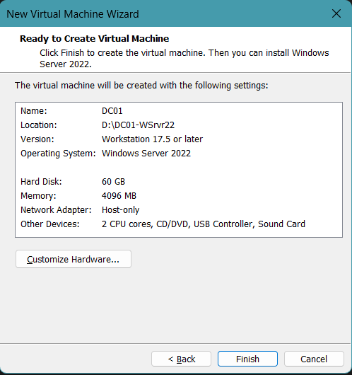
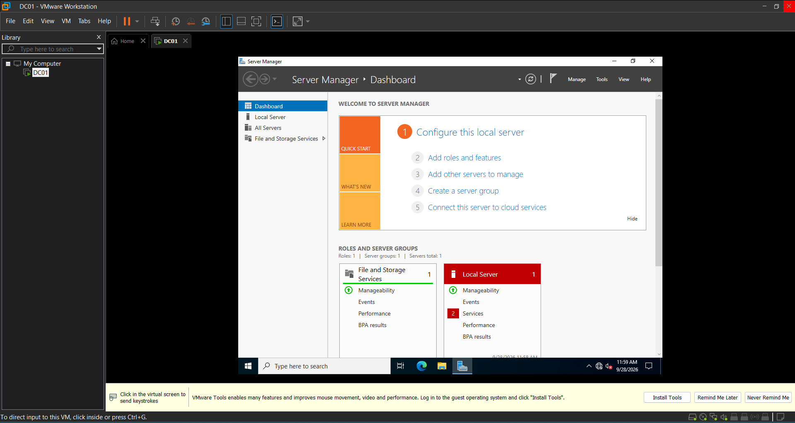
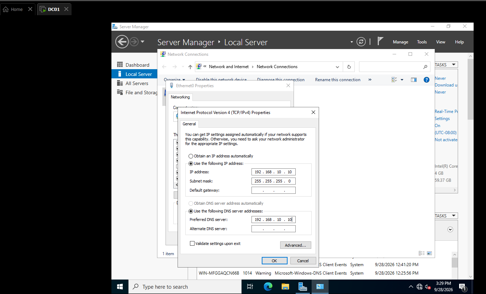
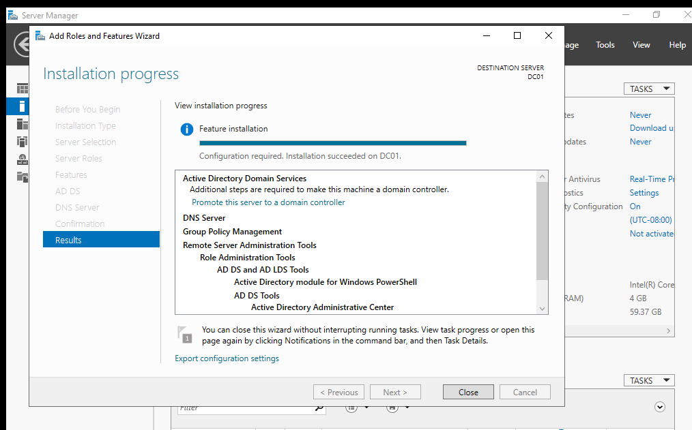
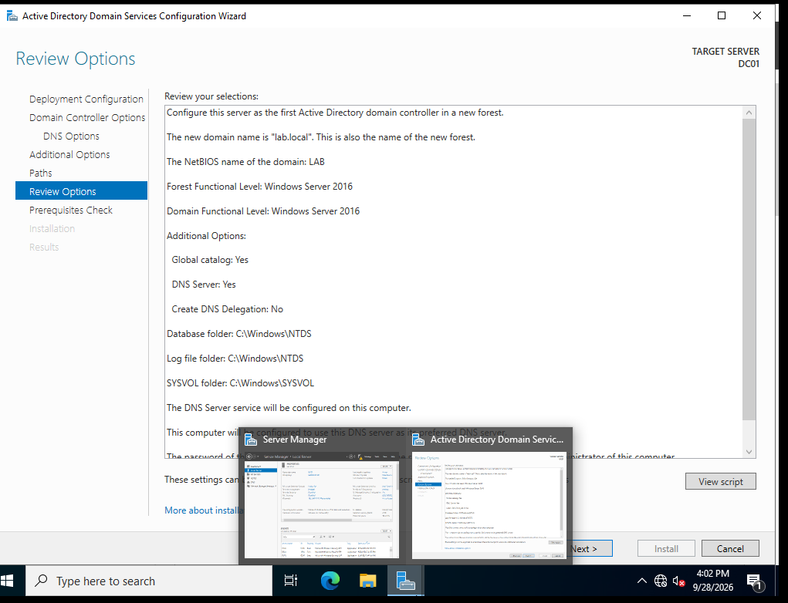
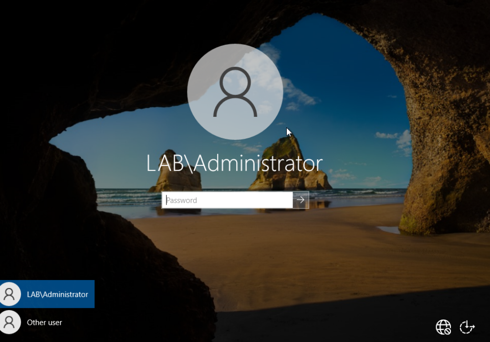

# Project 1: Domain Controller

## Goal
Build a Windows Server VM (DC01) that acts as a domain controller for a new forest, `lab.local`, running AD DS and DNS.

## Environment
- VM name: DC01
- Hypervisor: VMware Workstation Pro 17
- Specs: 2 CPU cores, 4 GB RAM, 60 GB disk
- OS: Windows Server 2022
- Network mode: Host-Only 
- Static IP: 192.168.10.10 / 255.255.255.0, DNS = 192.168.10.10 (itself)

## Steps completed
- [x] Created DC01 VM
- [x] Installed Windows Server (Standard, Desktop Experience)
- [x] Set static IP
- [x] Renamed server to DC01 and rebooted
- [x] Installed AD DS and DNS Server roles
- [x] Promoted to domain controller (new forest `lab.local`)
- [x] Verified AD and DNS (ADUC opens, forward lookup zone `lab.local` exists)

## Build notes

### Creating the VM
DC01 was created with 2 CPU cores, 4 GB RAM, and a 60 GB disk on host-only networking.



### Installing Windows Server 2022
Installed Standard (Desktop Experience), then logged in for the first time.



### Setting a static IP
Set DC01's IP to 192.168.10.10/255.255.255.0, pointing DNS at itself, so its address never changes.



### Installing AD DS and DNS roles
Installed the Active Directory Domain Services and DNS Server roles.



### Promoting to a domain controller
Promoted DC01 to a domain controller, creating a new forest and domain: `lab.local`.



After the restart, the login screen showed LAB\Administrator, confirming the domain was created.



### Optional: DHCP
- [ ] Installed DHCP Server role and completed configuration
- [ ] Created scope 192.168.10.100 - 192.168.10.200
- [ ] Set options: 003 gateway, 006 DNS (192.168.10.10), 015 domain (lab.local)
- [ ] Activated scope

## Screenshots to capture
Save into `screenshots/` and link them here.
1. VM settings (CPU, RAM, disk, network)
2. Static IP configuration
3. Roles installed in Server Manager
4. Promotion wizard summary (blank out any passwords)
5. ADUC showing the domain
6. DNS Manager showing the `lab.local` zone

## Verification
```
ipconfig /all
nslookup lab.local
```
Paste results here.

## Problems and fixes
See [TROUBLESHOOTING.md](../TROUBLESHOOTING.md). Summarize the big ones here.

## What I learned
-
-
