# Project 2: Active Directory

## Goal
Join a Windows client to `lab.local` and perform core AD administration: OUs, users, groups, and Group Policy.


## Environment
- VM name: PC01
- Specs: 2 CPU cores, 4 GB RAM, 60 GB disk
- OS: Windows 11
- Same VM network as DC01 (VMnet1, host-only, subnet corrected to 192.168.10.0/24)
- IP: 192.168.10.100 (via DHCP from DC01); DNS = 192.168.10.10

## Steps completed
- [x] Created PC01 on the same network as DC01
- [x] Set DNS to 192.168.10.10
- [x] Tested `ping 192.168.10.10` and `nslookup lab.local`
- [x] Joined the domain and rebooted
- [x] Created OUs: Lab-Admins, Staff, Workstations
- [x] Created user `jdoe`
- [x] Created groups `GG-IT-Admins` and `GG-Staff` and added members
- [x] Created a GPO on the "Staff" OU (Prohibit access to Control Panel)
- [x] Logged in as `jdoe`, ran `gpupdate /force`, confirmed Control Panel is blocked

## Screenshots to capture
1. Successful ping and nslookup from PC01
2. "Welcome to the lab.local domain" message
3. OU structure in ADUC
4. Users and groups
5. GPO in Group Policy Management
6. Control Panel blocked message on PC01 as jdoe

## Verification
```
whoami
gpupdate /force
gpresult /r
```
Paste results here.
## Networking setup and troubleshooting

Before joining the domain, I confirmed PC01 could reach DC01 over the network.

### Problem: PC01 got the wrong IP
PC01 received 192.168.226.130 from DHCP Server 192.168.226.254, not the 192.168.10.x network DC01 lives on.

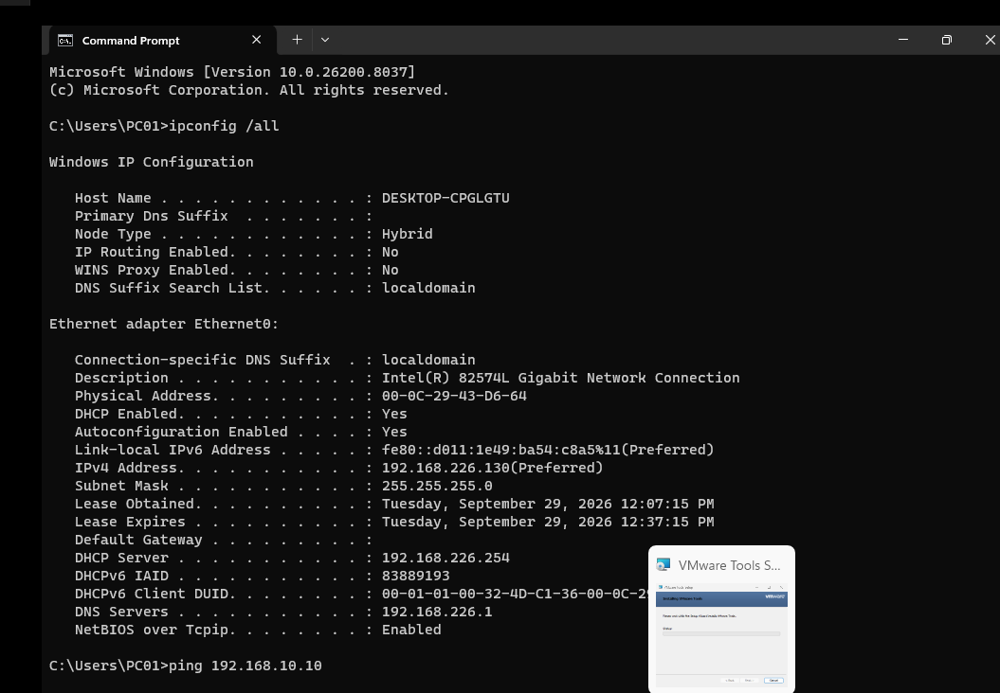

### Fix: disabled VMware's competing DHCP service
VMware Workstation runs its own built-in DHCP on host-only networks (VMnet1) by default. This conflicted with the DHCP server on DC01. Disabled "Use local DHCP service to distribute IP addresses to VMs" on VMnet1 and set its subnet to 192.168.10.0/24 to match the lab design.

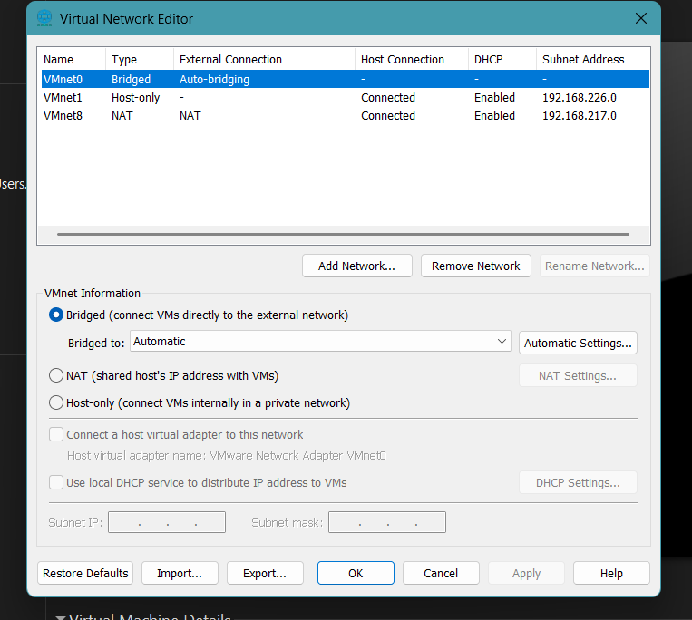

### Result: PC01 got the correct lease from DC01
After releasing and renewing, PC01 received 192.168.10.100 from DHCP Server 192.168.10.10 (DC01), with DNS also set to 192.168.10.10.

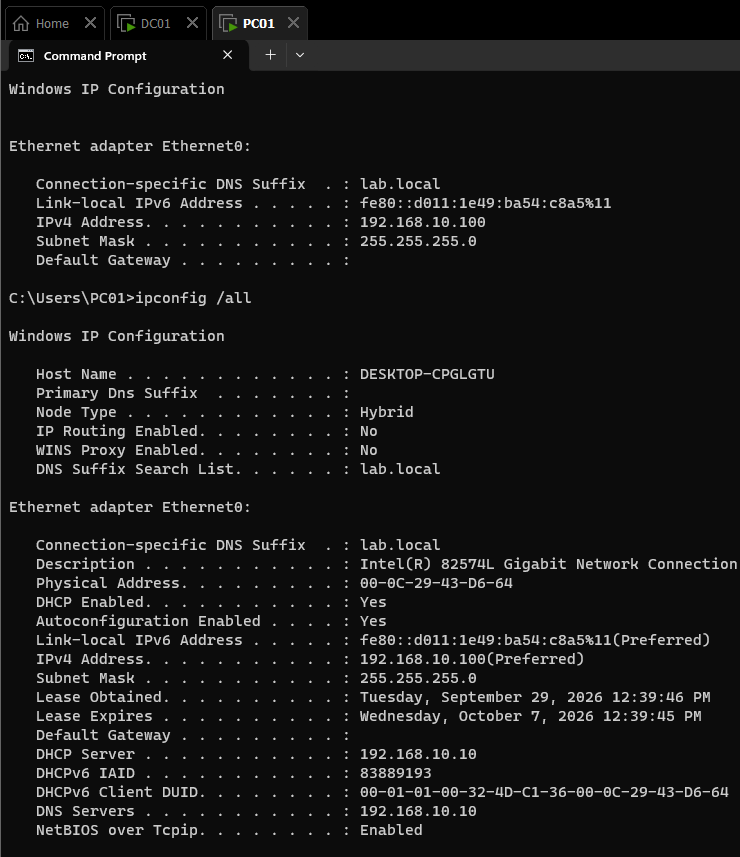

### Verified connectivity to DC01
Pinged DC01 successfully (0% loss) and resolved lab.local via nslookup.

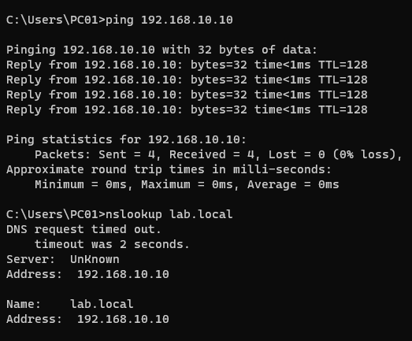

## Joining PC01 to the domain

Joined PC01 to lab.local and confirmed the join from both sides.

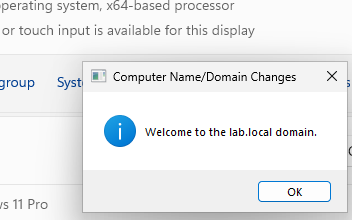

Logged in on PC01 using the domain account LAB\Administrator, confirming PC01 now trusts DC01 for authentication instead of using a local account.

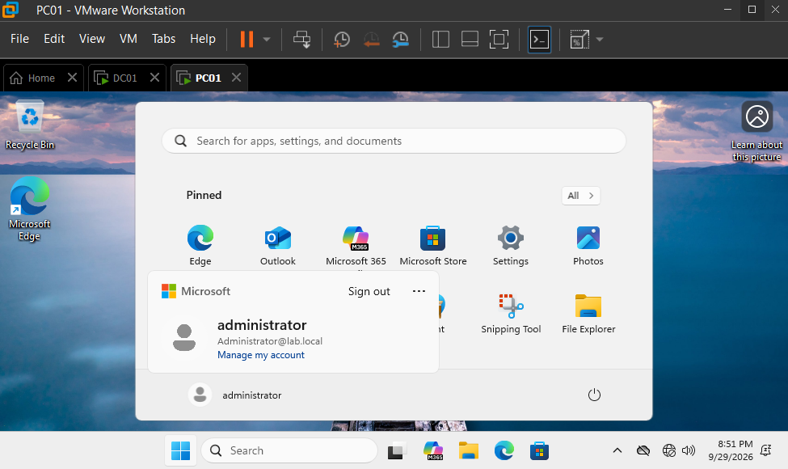

Verified from the server side: PC01 appears under lab.local > Computers in Active Directory Users and Computers.

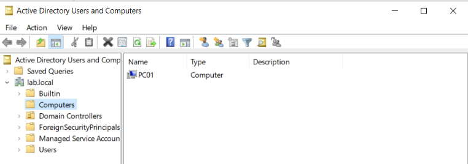

## Building the AD structure

Created a basic OU structure to organize users, groups, and computers, since the built-in Users/Computers containers can't have Group Policy applied to them directly.

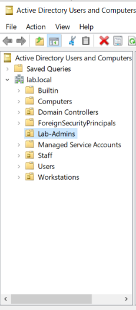

Created two security groups: GG-IT-Admins (in Lab-Admins OU) and GG-Staff (in Staff OU).

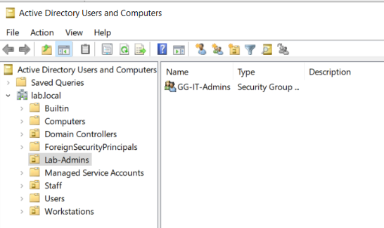


Created a user, John Doe (logon name: jdoe), inside the Staff OU.

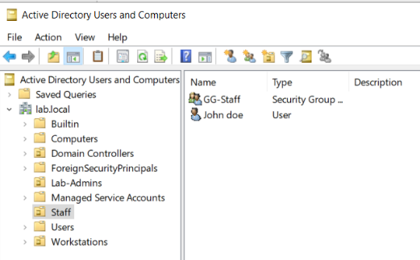

Added jdoe as a member of GG-Staff.

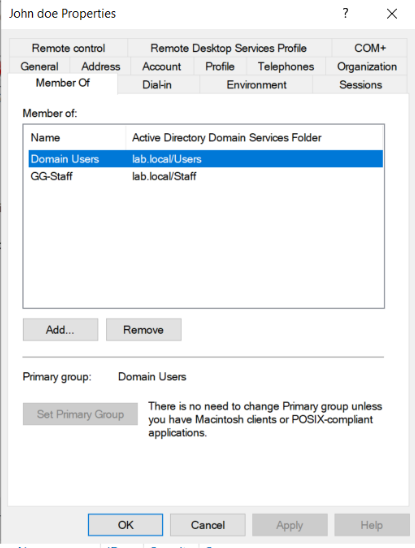

## Group Policy: blocking Control Panel for Staff

Created a GPO named Block-ControlPanel, linked to the Staff OU, to test that policy enforcement works across the domain.

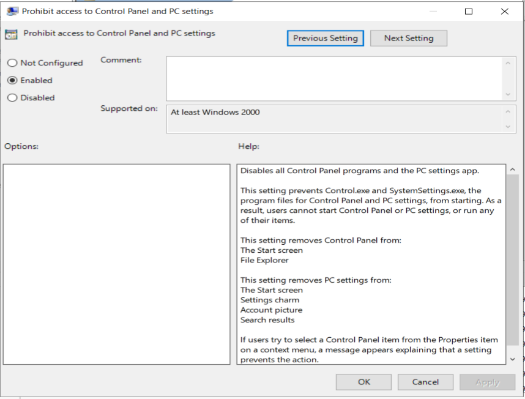

Logged into PC01 as jdoe (a member of the Staff OU) and ran `gpupdate /force` to apply the policy. Control Panel was blocked as expected.

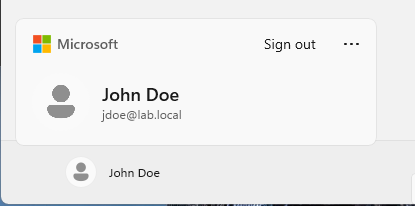

Confirmed the policy was actually applied (not just coincidentally blocked) using `gpresult /r`, which listed Block-ControlPanel under Applied Group Policy Objects.

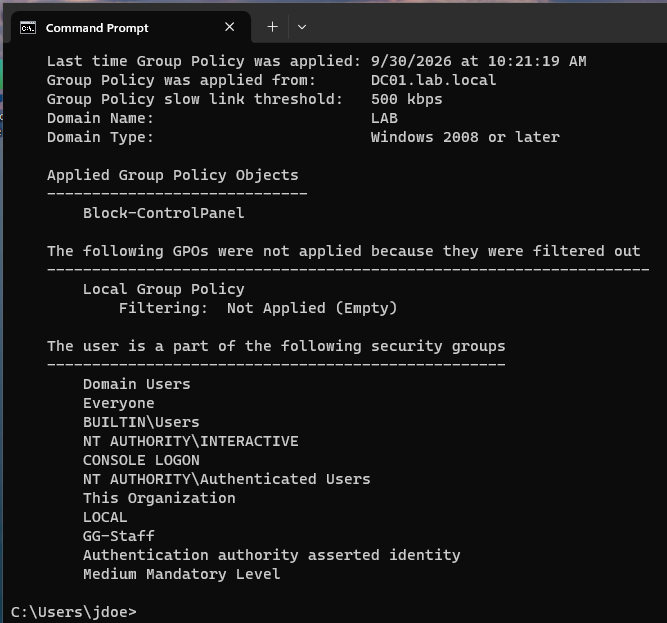

## Problems and fixes
See [TROUBLESHOOTING.md](../TROUBLESHOOTING.md).

## What I learned
-
-
